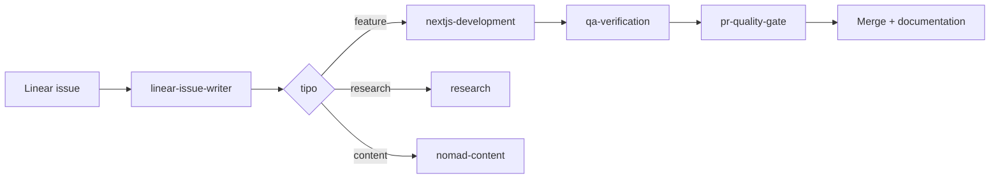

# Agentes de desarrollo — MdPDev

Estructura de trabajo para Cursor Cloud Agents, Linear y QA. Diseñada para que el desarrollo sea consistente entre features, PRs y agentes en paralelo.

## Arquitectura

```
.cursor/
├── README.md                 ← este archivo
├── rules/                    ← reglas estáticas (siempre o por glob)
│   ├── 00-core-mdpdev.mdc
│   ├── 10-nomad-hub-data.mdc
│   ├── 20-nomad-hub-ui.mdc
│   ├── 30-nomad-hub-seo.mdc
│   └── 40-nomad-hub-content.mdc
└── skills/                   ← workflows dinámicos (SKILL.md)
    ├── README.md
    ├── workflow/             ← orquestación y calidad
    ├── linear/               ← project management
    ├── development/          ← implementación
    ├── testing/              ← QA y seguridad
    ├── nomad-hub/            ← skills del Nomad & IT Hub
    └── research/             ← investigación documentada
```

## Cómo encajan rules vs skills

| Capa | Ubicación | Cuándo aplica |
|------|-----------|---------------|
| **Rules** | `.cursor/rules/*.mdc` | Siempre (`alwaysApply`) o al tocar archivos que matchean `globs` |
| **Skills** | `.cursor/skills/**/SKILL.md` | El agente los carga cuando la tarea coincide con `description`, o con `/nombre-skill` |
| **AGENTS.md** | raíz del repo | Contexto global para Cloud Agents (comandos, gotchas, env) |
| **ARCHITECTURE.md** | raíz | Fuente de verdad técnica — actualizar en cada PR estructural |

## Flujo de trabajo recomendado



### Por tipo de tarea

| Tarea | Skill principal | Rules relacionadas |
|-------|-----------------|-------------------|
| Crear issue en Linear | `linear/linear-issue-writer` | — |
| Gestionar ciclo de vida | `linear/linear-workflow` | — |
| Feature Next.js | `development/nextjs-development` | `00-core`, `20-ui` |
| Migración Supabase | `nomad-hub/data-backend` | `10-data` |
| Página del hub | `nomad-hub/ui-frontend` | `20-ui`, `30-seo` |
| SEO / metadata | `nomad-hub/seo` | `30-seo` |
| JSON curado | `nomad-hub/content` | `40-content` |
| QA post-implementación | `testing/qa-verification` | — |
| RLS / seguridad DB | `testing/security-rls` | `10-data` |
| Orquestar varios agentes | `workflow/orchestrator` | todas |
| Cerrar PR | `workflow/pr-quality-gate` | `00-core` |

## Linear MCP

El servidor Linear está disponible en Cursor. Los skills de `linear/` documentan convenciones de issues, estados y comentarios para MdPDev. Herramientas clave: `save_issue`, `list_issues`, `get_issue`, `save_comment`.

## Testing actual

El proyecto usa hoy:

- `npm run lint` — ESLint + TypeScript
- `npm run build` — compilación Next.js
- `npm run security:verify` — verificación RLS
- `npm run security:regression` — regresión de políticas

Playwright E2E está planificado; el skill `testing/qa-verification` documenta el checklist manual mientras no haya suite automatizada.

## Documentación relacionada

- [`ARCHITECTURE.md`](../ARCHITECTURE.md) — stack, rutas, Supabase
- [`BRAND.md`](../BRAND.md) — identidad visual y voz
- [`AGENTS.md`](../AGENTS.md) — instrucciones Cloud Agent
- [`docs/nomad-it-hub/05-agent-orchestration.md`](../docs/nomad-it-hub/05-agent-orchestration.md) — DAG y contratos entre workstreams
- [`docs/nomad-it-hub/06-audit-qa-plan.md`](../docs/nomad-it-hub/06-audit-qa-plan.md) — plan de QA

## Fuentes de los skills instalados

Adaptados e integrados desde:

- [Cursor Agent Skills docs](https://cursor.com/docs/skills) — formato SKILL.md oficial
- [aussiegingersnap/cursor-skills](https://github.com/aussiegingersnap/cursor-skills) — `tools-linear`
- [Vercel agent-skills](https://github.com/vercel-labs/agent-skills) — patrones Next.js
- Skills internos de `feat-agent-skills` y `docs/nomad-it-hub/skills/` del propio repo
