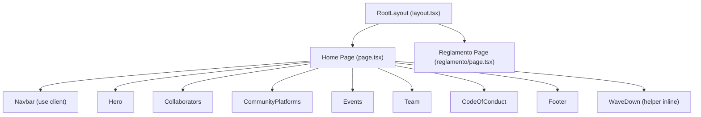
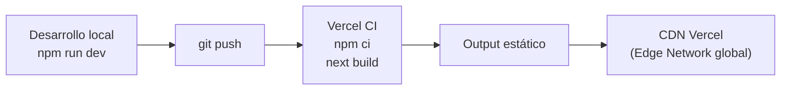

# Arquitectura — MdPDev

## 1. Overview

**MdPDev** es la landing page de la comunidad tech de Mar del Plata ("El Hub Tech de la Costa Atlántica"). Conecta desarrolladores, diseñadores y emprendedores de la ciudad.

El sitio es completamente estático: sin backend, sin base de datos, sin autenticación. Todo el contenido está hardcodeado en los componentes y la única integración externa es un enlace a un grupo de WhatsApp como CTA principal.

---

## 2. Stack tecnológico

| Capa | Tecnología |
|---|---|
| Framework | Next.js 15 (App Router) |
| UI Library | React 19 |
| Lenguaje | TypeScript 5 (strict mode) |
| Estilos | Tailwind CSS v4 via `@tailwindcss/postcss` |
| Fuentes | Inter + Space Grotesk via `next/font/google` |
| Deploy | Vercel |
| Linting | ESLint 9 con `eslint-config-next` |

**Dependencias de runtime** (solo 3):

```json
"next": "^15",
"react": "^19",
"react-dom": "^19"
```

Sin librerías de UI, sin state management, sin librerías de animación.

---

## 3. Estructura de carpetas

```
mardelplata/
├── src/
│   ├── app/
│   │   ├── globals.css              # tema Tailwind (@theme) + animaciones CSS
│   │   ├── layout.tsx               # root layout: metadata, fuentes, <html>
│   │   ├── page.tsx                 # home (/)
│   │   └── reglamento/
│   │       └── page.tsx             # código de conducta (/reglamento)
│   └── components/
│       ├── Navbar.tsx               # "use client" — scroll + menú mobile
│       ├── Hero.tsx                 # sección hero con CTAs
│       ├── Collaborators.tsx        # llamado a colaboradores/sponsors
│       ├── CommunityPlatforms.tsx   # link al grupo de WhatsApp
│       ├── Events.tsx               # próximos eventos (Cursor Cafe)
│       ├── Team.tsx                 # perfil de los co-fundadores
│       ├── CodeOfConduct.tsx        # teaser con link a /reglamento
│       ├── WaveDivider.tsx          # componente SVG reutilizable de transición
│       └── Footer.tsx               # footer con links y marca
├── vercel.json                      # config de deploy
├── package.json
└── tsconfig.json
```

---

## 4. Jerarquía de componentes



### Composición de la home (`page.tsx`)

Las secciones se apilan verticalmente con separadores SVG (`WaveDown`) entre ellas para crear transiciones fluidas de color:

```
Navbar (fixed)
└── main
    ├── Hero
    ├── Collaborators
    ├── ~ WaveDown (white → sky)
    ├── CommunityPlatforms
    ├── ~ WaveDown (sky → white)
    ├── Events
    ├── ~ WaveDown (white → sky)
    ├── Team
    ├── ~ WaveDown (sky → white)
    └── CodeOfConduct
Footer
```

---

## 5. Modelo de rendering

El sitio aprovecha el App Router de Next.js 15 con **React Server Components (RSC) por defecto**.

| Componente | Tipo | Motivo |
|---|---|---|
| `layout.tsx` | Server Component | Metadata estática, sin interactividad |
| `page.tsx` (home) | Server Component | Composición pura de secciones |
| `page.tsx` (reglamento) | Server Component | Contenido estático |
| `Hero.tsx` | Server Component | Sin estado ni eventos |
| `Collaborators.tsx` | Server Component | Sin estado ni eventos |
| `CommunityPlatforms.tsx` | Server Component | Sin estado ni eventos |
| `Events.tsx` | Server Component | Sin estado ni eventos |
| `Team.tsx` | Server Component | Sin estado ni eventos |
| `CodeOfConduct.tsx` | Server Component | Sin estado ni eventos |
| `Footer.tsx` | Server Component | Sin estado ni eventos |
| `WaveDivider.tsx` | Server Component | SVG puro |
| **`Navbar.tsx`** | **Client Component** | Listener de scroll + estado del menú hamburguesa |

No existen `getServerSideProps`, `getStaticProps` ni API routes. El output de `next build` es un sitio completamente estático.

---

## 6. Sistema de estilos

### Tailwind CSS v4 con tema personalizado

El tema se define en [`src/app/globals.css`](src/app/globals.css) usando el bloque `@theme` de Tailwind v4:

**Paleta ocean** (identidad visual principal):
```
ocean-50  → #CAF0F8   ocean-500 → #0096C7
ocean-100 → #ADE8F4   ocean-600 → #0077B6
ocean-200 → #90E0EF   ocean-700 → #023E8A
ocean-300 → #48CAE4   ocean-800 → #03045E
ocean-400 → #00B4D8   ocean-900 → #020030
```

**Paleta sand** (acentos cálidos):
```
sand-100 → #FEF9EE   sand-400 → #E9D5A0
sand-200 → #F8EDD8   sand-500 → #D4B483
sand-300 → #F4E4C1
```

**Tipografía** (variables CSS via `next/font`):
- `--font-sans` → Inter (cuerpo de texto)
- `--font-display` → Space Grotesk (títulos y headings)

### Clases utilitarias globales

| Clase | Descripción |
|---|---|
| `.hero-bg` | Gradiente diagonal deep-ocean para el hero |
| `.gradient-text` | Texto con gradiente ocean (clip-path) |
| `.ocean-tint` | Fondo degradado suave cielo → celeste |
| `.dots-bg` | Patrón de puntos con radial-gradient |
| `.event-header` | Gradiente azul para la cabecera de eventos |

### Animaciones CSS puras

| Clase | Keyframe | Descripción |
|---|---|---|
| `.wave-drift` | `wave-drift` | Desplazamiento horizontal infinito (olas del hero) |
| `.float-1/2/3` | `float` | Levitación suave con delays escalonados (cards) |
| `.pulse-dot` | `pulse-ring` | Ring pulsante para indicadores de estado |

---

## 7. Pipeline de deploy



Configuración en [`vercel.json`](vercel.json):

```json
{
  "framework": "nextjs",
  "buildCommand": "npm run build",
  "installCommand": "npm ci"
}
```

---

## 8. Páginas y rutas

| Ruta | Archivo | Descripción |
|---|---|---|
| `/` | `src/app/page.tsx` | Landing page principal con todas las secciones |
| `/reglamento` | `src/app/reglamento/page.tsx` | Código de conducta de la comunidad (7 reglas) |

---

## 9. Decisiones de diseño

- **Cero dependencias de UI**: todos los componentes están escritos desde cero con Tailwind. Sin shadcn, sin MUI, sin Radix.
- **Iconos SVG inline**: todos los íconos son paths SVG directamente en JSX. Sin `lucide-react` ni similares.
- **Animaciones CSS-only**: sin Framer Motion ni GSAP. Toda la animación es CSS puro definido en `globals.css`.
- **CTA unificado**: el call-to-action de toda la página es un único destino — el grupo de WhatsApp de la comunidad.
- **`WaveDown` inline en `page.tsx`**: el helper de transición entre secciones vive directamente en el page en lugar de ser un import adicional, dado que es una función simple de una sola responsabilidad usada solo ahí.
- **Identidad visual oceánica**: la paleta, el mascot (león marino), las animaciones de olas y los gradientes profundos reflejan la identidad costera de Mar del Plata.
