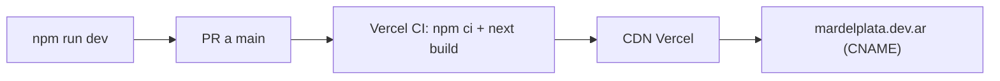

# Arquitectura — MdPDev

> Documento vivo. Refleja el estado actual del repo. Si tocás algo estructural (rutas, esquema de Supabase, dependencias, flujos de auth), actualizá la sección correspondiente en el mismo PR.

---

## 1. Overview

**MdPDev** (`mardelplata.dev.ar`) es la plataforma de la comunidad tech de Mar del Plata — "El Hub Tech de la Costa Atlántica". No es solo una landing: combina contenido estático de marca con funcionalidad dinámica respaldada por Supabase.

Lo que hay hoy:

- **Landing pública** con eventos, fundadores y miembros recientes.
- **Auth completa** (signup/login/email verification) con Supabase Auth.
- **Perfiles de miembros** con avatar, bio, redes y QR personal.
- **Vista pública de miembro** vía QR (`/miembro?code=…`).
- **Admin dashboard** (eventos, usuarios) restringido a `is_admin`.
- **Scanner QR** para registrar asistencia a eventos en tiempo real.
- **Bolsa de trabajo** (clasificados de empleo y freelance con votos).
- **Primer Trabajo OS** — herramienta autocontenida con diagnóstico, plan de acción, guías y simulador HR (estado en `localStorage`, sin backend).
- **Marketing Kit y Brand Book** estáticos.

---

## 2. Stack tecnológico

| Capa | Tecnología |
|---|---|
| Framework | Next.js 15 (App Router) |
| UI Library | React 19 |
| Lenguaje | TypeScript 5 (strict mode) |
| Estilos | Tailwind CSS v4 vía `@tailwindcss/postcss` |
| Fuentes | Inter + Space Grotesk (`next/font/google`) |
| Backend | Supabase (Auth + Postgres + Row Level Security) |
| QR | `qrcode.react` (generación) + `@zxing/library` (escaneo) |
| Deploy | Vercel (CNAME → `mardelplata.dev.ar`) |
| Linting | ESLint 9 con `eslint-config-next` |

**Dependencias de runtime** (ver `package.json`):

```json
"@supabase/ssr": "^0.5.2",
"@supabase/supabase-js": "^2.49.1",
"@zxing/library": "^0.21.3",
"next": "^15",
"qrcode.react": "^4.2.0",
"react": "^19",
"react-dom": "^19"
```

Sin librerías de UI (shadcn/MUI/Radix), sin state management, sin librerías de animación. Todos los íconos son SVG inline.

---

## 3. Variables de entorno

Definir en `.env.local` (no se commitea — `.gitignore` cubre `.env*.local`):

| Variable | Descripción |
|---|---|
| `NEXT_PUBLIC_SUPABASE_URL` | URL del proyecto Supabase |
| `NEXT_PUBLIC_SUPABASE_ANON_KEY` | API key pública (anon role) |

Sin estas variables:
- La home renderiza pero los queries fallan en silencio y los datos quedan en `[]`.
- Auth, perfil, admin, scanner y bolsa **no funcionan**.
- `/primer-trabajo`, `/reglamento`, `/brand`, `/marketing-kit` siguen funcionando porque son estáticos.

---

## 4. Estructura de carpetas

```
mardelplata/
├── src/
│   ├── app/
│   │   ├── globals.css                     # tema Tailwind v4 + utilidades + animaciones
│   │   ├── layout.tsx                      # root layout (metadata, fuentes)
│   │   ├── page.tsx                        # home (/) — server component, Supabase
│   │   ├── reglamento/page.tsx             # código de conducta
│   │   ├── brand/page.tsx                  # brand book público
│   │   ├── marketing-kit/page.tsx          # templates de comunicación
│   │   ├── miembro/page.tsx                # /miembro?code=… — vista pública vía QR
│   │   ├── perfil/
│   │   │   ├── page.tsx                    # gate de auth + carga de perfil
│   │   │   └── ProfileClient.tsx           # editor de perfil, avatar picker, QR
│   │   ├── admin/
│   │   │   ├── layout.tsx                  # gate por is_admin (client-side)
│   │   │   ├── page.tsx                    # carga events + profiles
│   │   │   ├── AdminDashboard.tsx          # tabs: events / users / scanner
│   │   │   └── scanner/page.tsx            # cámara + zxing + registro asistencia
│   │   ├── auth/
│   │   │   ├── login/page.tsx
│   │   │   ├── registro/page.tsx           # con cooldown anti rate-limit
│   │   │   ├── callback/page.tsx           # exchange de code → session, crea profile
│   │   │   ├── verificar/page.tsx          # "revisá tu email"
│   │   │   └── error/page.tsx
│   │   ├── bolsa/
│   │   │   ├── layout.tsx
│   │   │   └── page.tsx                    # → BolsaClient
│   │   └── primer-trabajo/
│   │       ├── layout.tsx                  # metadata
│   │       ├── page.tsx                    # índice de la herramienta
│   │       ├── diagnostico/page.tsx
│   │       ├── plan/page.tsx
│   │       ├── empresas/page.tsx
│   │       ├── entrevista-hr/page.tsx
│   │       └── guia/
│   │           ├── layout.tsx
│   │           ├── cv/page.tsx
│   │           └── linkedin/page.tsx
│   ├── components/
│   │   ├── Navbar.tsx                      # client — scroll + auth state + mobile menu
│   │   ├── Hero.tsx
│   │   ├── Collaborators.tsx               # marquee de miembros
│   │   ├── CommunityPlatforms.tsx
│   │   ├── Events.tsx
│   │   ├── Team.tsx                        # co-fundadores con datos de Supabase
│   │   ├── CodeOfConduct.tsx
│   │   ├── WaveDivider.tsx
│   │   ├── Footer.tsx
│   │   ├── bolsa/
│   │   │   ├── BolsaClient.tsx             # listado + voto + filtros
│   │   │   ├── ClassifiedCard.tsx
│   │   │   ├── ClassifiedModal.tsx
│   │   │   ├── PublishWizard.tsx           # form multi-step
│   │   │   └── ShareButton.tsx
│   │   └── primer-trabajo/
│   │       ├── DiagnosticoClient.tsx
│   │       ├── PlanClient.tsx
│   │       ├── EmpresasClient.tsx
│   │       ├── HrInterviewQuizClient.tsx
│   │       ├── PatternGuideList.tsx
│   │       ├── GuiaSubnav.tsx
│   │       └── MissionCallout.tsx
│   ├── content/
│   │   └── primer-trabajo/                 # bundles JSON + index TS
│   │       ├── bundle-base.json
│   │       ├── bundle-sections.json
│   │       ├── bundle-checklist.json
│   │       ├── empresas.json
│   │       ├── hr-interview-quiz.json
│   │       ├── patterns-cv.json
│   │       ├── patterns-linkedin.json
│   │       └── index.ts
│   └── lib/
│       ├── avatarPresets.ts                # presets, allowlist de fotos, retiros
│       ├── urls.ts                         # normalización de URLs externas
│       ├── supabase/
│       │   ├── client.ts                   # createBrowserClient
│       │   ├── server.ts                   # createServerClient (RSC)
│       │   └── middleware.ts               # updateSession para edge middleware
│       ├── primer-trabajo/
│       │   ├── engine.ts                   # runDiagnostic + scoring
│       │   ├── persist.ts                  # hook con localStorage v1
│       │   ├── types.ts
│       │   ├── guideTypes.ts
│       │   ├── hr-quiz.ts
│       │   ├── mission-callouts.ts
│       │   └── silver-dev.ts
│       └── types/
│           └── classifieds.ts
├── scripts/                                # SQL de Supabase (correr en SQL Editor)
│   ├── 001_create_profiles_and_events.sql
│   ├── 002_seed_initial_events.sql
│   ├── 003_classified_listings.sql
│   ├── 004_clear_retired_nextsolution_avatar.sql
│   └── 005_clear_retired_whatsapp_02_avatar.sql
├── public/
│   ├── avatar-icons/                       # presets servidos a /perfil
│   ├── avatars/
│   ├── mdpdev.png
│   └── CNAME
├── docs/
│   └── admin-qr-scanner-runbook.md         # checklist operativo del scanner
├── avatar-icons/                           # source assets (no servidos directamente)
├── config/
│   └── mcporter.json
├── index.html, reglamento.html             # versiones HTML legacy (no usadas por Next)
├── next.config.ts                          # images.unoptimized + Permissions-Policy scanner
├── vercel.json
├── tsconfig.json, eslint.config.mjs, postcss.config.mjs
├── AGENTS.md, BRAND.md, ARCHITECTURE.md
└── package.json
```

---

## 5. Rutas

| Ruta | Tipo | Datos |
|---|---|---|
| `/` | Server (RSC) | Supabase: `events`, `profiles` (founders + 30 últimos miembros) |
| `/reglamento` | Static | — |
| `/brand` | Static | — |
| `/marketing-kit` | Static | — |
| `/miembro?code=:qr_code` | Client (Suspense) | Supabase: `profiles` por `qr_code` |
| `/auth/login` | Client | Supabase Auth (`signInWithPassword`) |
| `/auth/registro` | Client | Supabase Auth (`signUp`) + cooldown sessionStorage |
| `/auth/callback` | Client (Suspense) | `exchangeCodeForSession` + upsert de `profiles` |
| `/auth/verificar` | Static | — |
| `/auth/error` | Static | — |
| `/perfil` | Client | Supabase: `profiles` del usuario actual |
| `/admin` | Client | Gate por `is_admin`; carga `events` + `profiles` |
| `/admin/scanner` | Client | `getUserMedia` + zxing + insert en `event_attendance` |
| `/bolsa` | Client | Supabase: `classified_listings` + `classified_votes` |
| `/primer-trabajo` | Static | Índice — links a sub-páginas |
| `/primer-trabajo/diagnostico` | Client | `localStorage` (`mdpdev-primer-trabajo-v1`) |
| `/primer-trabajo/plan` | Client | `localStorage` |
| `/primer-trabajo/entrevista-hr` | Client | `localStorage` |
| `/primer-trabajo/empresas` | Client | JSON bundle |
| `/primer-trabajo/guia/cv` | Client | JSON bundle |
| `/primer-trabajo/guia/linkedin` | Client | JSON bundle |

> No hay API routes propias. Toda la lectura/escritura va directo al cliente Supabase desde el browser o desde server components.

---

## 6. Modelo de rendering

App Router con **React Server Components por defecto**. Los componentes que usan estado, eventos, `useEffect`, cámara, localStorage, o Supabase desde el browser están marcados con `"use client"`.

| Componente | Tipo | Motivo |
|---|---|---|
| `app/layout.tsx` | Server | Metadata + fuentes |
| `app/page.tsx` | **Server (async)** | Fetch directo a Supabase con server client |
| `Hero`, `Collaborators`, `CommunityPlatforms`, `Events`, `Team`, `CodeOfConduct`, `Footer`, `WaveDivider` | Server | Composición pura |
| `Navbar` | Client | Scroll listener, menú móvil, suscripción a `auth.onAuthStateChange` |
| `app/perfil/page.tsx` + `ProfileClient` | Client | Form + avatar picker + QR + redirect post-auth |
| `app/admin/*` | Client | Gate por rol + dashboards interactivos |
| `app/admin/scanner/page.tsx` | Client | `getUserMedia` + zxing |
| `app/bolsa/page.tsx` (+ children) | Client | Wizard de publicación + votos |
| `app/auth/login` / `registro` / `callback` / `miembro` | Client | Forms con submit a Supabase, querystring |
| `app/primer-trabajo/*` (la mayoría) | Client | Persistencia en localStorage |

---

## 7. Supabase

### 7.1 Clientes

Tres puntos de entrada en `src/lib/supabase/`:

- **`client.ts`** — `createBrowserClient` para componentes `"use client"`.
- **`server.ts`** — `createServerClient` con cookies de Next, para RSC y server actions. El proyecto usa Fluid Compute → instanciar uno por request, nunca compartirlo.
- **`middleware.ts`** — `updateSession(request)` refresca cookies en cada request. Hoy está disponible pero **no hay un `middleware.ts` raíz** activo; si se agrega, debe redirigir `/protected/*` a `/auth/login`.

### 7.2 Esquema (migraciones en `scripts/`)

**Tablas:**

```
profiles
  id                  UUID PK → auth.users(id) ON DELETE CASCADE
  email               TEXT
  full_name           TEXT
  avatar_url          TEXT
  qr_code             TEXT UNIQUE              -- usado en /miembro y scanner
  bio                 TEXT
  github_url, linkedin_url, twitter_url TEXT
  is_admin            BOOLEAN DEFAULT false    -- gate de /admin
  created_at, updated_at TIMESTAMPTZ

events
  id                  UUID PK
  title, subtitle, description TEXT
  date, end_date      TIMESTAMPTZ
  location            TEXT
  tags                TEXT[]
  image_url, registration_url TEXT
  is_mystery          BOOLEAN
  codename, teaser    TEXT                     -- para eventos misteriosos
  is_published        BOOLEAN DEFAULT true
  created_by          UUID → auth.users(id)
  created_at, updated_at TIMESTAMPTZ

event_attendance
  id                  UUID PK
  event_id            UUID → events(id)
  user_id             UUID → auth.users(id)
  scanned_at          TIMESTAMPTZ
  scanned_by          UUID → auth.users(id)
  UNIQUE(event_id, user_id)                    -- evita duplicados

classified_listings
  id                  UUID PK
  author_id           UUID → profiles(id)
  kind                TEXT CHECK ('job' | 'freelance')
  title, description, external_url TEXT
  positions           JSONB DEFAULT '[]'        -- array de {title, description, link}
  tags                TEXT[]
  created_at          TIMESTAMPTZ
  expires_at          TIMESTAMPTZ DEFAULT now() + INTERVAL '30 days'

classified_votes
  PRIMARY KEY (listing_id, user_id)
  vote                SMALLINT CHECK (1 | -1)
```

### 7.3 Row Level Security

Todas las tablas tienen RLS habilitado.

| Tabla | Lectura | Escritura |
|---|---|---|
| `profiles` | Pública (todos) | Sólo el dueño (`auth.uid() = id`) |
| `events` | `is_published = true` (público) | Sólo `is_admin()` |
| `event_attendance` | Sólo `is_admin()` | Sólo `is_admin()` |
| `classified_listings` | Autenticados, vigentes (o propio si vencido) | Insert/delete del autor |
| `classified_votes` | Autenticados, sobre listings vigentes | Sólo voto propio |

Helper `public.is_admin()` con `SECURITY DEFINER` evita recursión leyendo `profiles.is_admin` por fuera de las policies.

### 7.4 Triggers

- `on_auth_user_created` — al crear un usuario en `auth.users`, inserta en `profiles` con `qr_code = gen_random_uuid()`. Idempotente (`ON CONFLICT DO NOTHING`).
- `set_profiles_updated_at` y `set_events_updated_at` — autoupdate de `updated_at`.

> El callback de auth (`/auth/callback`) hace además un upsert defensivo por si el trigger no corrió.

---

## 8. Flujo de autenticación

```
/auth/registro
  └── supabase.auth.signUp({ email, password, data: { full_name } })
      └── (si rate-limited) cooldown 60s en sessionStorage
      └── trigger crea profiles row con qr_code
      └── Supabase envía email de verificación
          └── /auth/verificar (mensaje "revisá tu email")

Click en email
  └── /auth/callback?code=…&next=/perfil
      └── exchangeCodeForSession(code)        -- dedupe in-memory
      └── upsert defensivo en profiles si no existe
      └── router.replace(next)                 -- default /perfil

/auth/login
  └── supabase.auth.signInWithPassword
      └── router.push('/perfil') + router.refresh()
```

Sign out: `supabase.auth.signOut()` desde Navbar/Profile/Admin.

---

## 9. Flujo del Scanner QR (`/admin/scanner`)

```
1. Gate de admin (admin/layout.tsx) — chequea is_admin, redirige si no.
2. Selección de evento activo (dropdown de events más recientes).
3. Iniciar Cámara →
   - chequea isSecureContext (HTTPS) y getUserMedia
   - enumera cámaras, prefiere "back/rear/environment/trasera"
   - BrowserMultiFormatReader.decodeFromConstraints
4. Por cada lectura:
   - extrae qr_code (acepta /miembro?code=… o /miembro/…)
   - dedupe ventana 2.5s + Set de pendientes + Set de ya-escaneados
   - busca profile por qr_code
   - INSERT en event_attendance (UNIQUE constraint detecta duplicados → 23505)
   - feedback: lastScanned banner + navigator.vibrate(200)
5. Fallback: ingreso manual (input de texto + Buscar).
```

Headers en `next.config.ts` para `/admin/scanner`:
- `Permissions-Policy: camera=(self)`
- `X-Frame-Options: SAMEORIGIN`

Runbook operativo: [`docs/admin-qr-scanner-runbook.md`](docs/admin-qr-scanner-runbook.md).

---

## 10. Bolsa de trabajo

`/bolsa` (cliente) consume `classified_listings` + `classified_votes`:

- **Listado**: query con join a `profiles` (autor), agregación de votos.
- **Filtros**: por `kind` (job/freelance) y por tags.
- **Publicación**: `PublishWizard` multi-step (kind → datos → posiciones → review → submit).
- **Votos**: `1` / `-1` por `(listing_id, user_id)`. Sólo sobre listings vigentes.
- **Vencimiento**: 30 días desde `created_at`. RLS oculta vencidos a terceros pero el autor sigue viéndolos.

Tipos en [`src/lib/types/classifieds.ts`](src/lib/types/classifieds.ts). Constantes: `CLASSIFIED_TITLE_MAX = 120`, `CLASSIFIED_DESC_MAX = 2000`, `CLASSIFIED_NEW_DAYS = 7`.

---

## 11. Primer Trabajo OS

Herramienta autocontenida — **no usa Supabase**. Todo en `localStorage` con clave `mdpdev-primer-trabajo-v1` (ver `src/lib/primer-trabajo/persist.ts`).

Estado persistido (`PrimerTrabajoPersisted`):

```ts
{
  schemaVersion: 1,
  diagnosticResult?: DiagnosticResult,
  checklistCheckedIds: string[],
  hrQuizResult?: HrQuizResult,
}
```

Componentes:

- **Diagnóstico** — preguntas con scoring por señales (ver `engine.ts` + `bundle-sections.json`).
- **Plan** — checklist con bad/good rewrites (`bundle-checklist.json`).
- **Guías CV / LinkedIn** — patrones (`patterns-cv.json`, `patterns-linkedin.json`).
- **Simulador HR** — quiz que actualiza la señal de entrevista del diagnóstico (`hr-interview-quiz.json`, `hr-quiz.ts`).
- **Empresas** — directorio (`empresas.json`).

El bundle se carga estáticamente desde JSON via `src/content/primer-trabajo/index.ts`.

---

## 12. Avatares

`src/lib/avatarPresets.ts` maneja:

- **`FLATICON_AVATARS`, `TECH_AVATARS`** — presets por defecto en `/avatar-icons/`.
- **`isAvatarPhotoAuthorizedEmail`** — allowlist de emails que pueden subir foto custom (resto se limita a presets).
- **Retirados** — `RETIRED_PRESET_AVATAR_URLS` incluye assets que se quitaron por error de uso (sponsor NextSolution, ícono whatsapp-02 mal categorizado). Las migraciones `004_*.sql` y `005_*.sql` los limpian de la DB.
- **`resolveAvatarDisplayUrl`** — fallback determinístico por nombre/email para perfiles sin avatar.

Reglas:

- Email autorizado → puede usar `avatar_url` arbitraria, salvo que esté en la lista de retirados.
- Email no autorizado → sólo URLs en la allowlist de presets; cualquier otra cae al fallback.

---

## 13. Sistema de estilos

### 13.1 Tailwind v4 con tema personalizado

Tema en [`src/app/globals.css`](src/app/globals.css) usando `@theme`. **No hay `tailwind.config.js`**.

**Paleta `ocean`** (primaria):

```
ocean-50  #CAF0F8   ocean-500 #0096C7
ocean-100 #ADE8F4   ocean-600 #0077B6
ocean-200 #90E0EF   ocean-700 #023E8A
ocean-300 #48CAE4   ocean-800 #03045E
ocean-400 #00B4D8   ocean-900 #020030
```

**Paleta `sand`** (acento cálido, no reemplaza a ocean):

```
sand-100 #FEF9EE   sand-400 #E9D5A0
sand-200 #F8EDD8   sand-500 #D4B483
sand-300 #F4E4C1
```

**Tipografía:**

- `--font-sans` → Inter
- `--font-display` → Space Grotesk

### 13.2 Utilidades globales

| Clase | Uso |
|---|---|
| `.hero-bg` | Gradiente diagonal deep-ocean (hero + auth + admin states) |
| `.gradient-text` | Texto con clip-path en gradiente ocean |
| `.ocean-tint` | Fondo degradado claro (sky → celeste suave) |
| `.dots-bg` | Patrón radial-gradient de puntos |
| `.event-header` | Gradiente azul para cabeceras de eventos |

### 13.3 Animaciones CSS puras

| Clase | Uso |
|---|---|
| `.wave-drift` | Olas del hero (16s linear infinite) |
| `.float-1`/`-2`/`-3` | Levitación con delays escalonados (5s) |
| `.pulse-dot` | Indicador pulsante de estado (2.2s) |
| `.community-marquee` | Carrusel infinito en `Collaborators` |

---

## 14. Pipeline de deploy



`vercel.json`:

```json
{ "framework": "nextjs", "buildCommand": "npm run build", "installCommand": "npm ci" }
```

`next.config.ts`:

- `images.unoptimized: true` (avatares vienen de Supabase Storage / paths arbitrarios).
- Headers específicos para `/admin/scanner` (camera + frame-options).

---

## 15. Comandos

| Tarea | Comando |
|---|---|
| Instalar | `npm install` |
| Dev server | `npm run dev` |
| Lint | `npm run lint` (deprecated en Next 16; warnings de `` vs `<Image>` son pre-existentes) |
| Build | `npm run build` |
| Start (prod local) | `npm run start` |

Scripts SQL: ejecutar en orden (`001` → `005`) desde el SQL Editor de Supabase.

---

## 16. Decisiones de diseño y convenciones

- **Cero dependencias de UI**: todo escrito a mano con Tailwind. Sin shadcn/MUI/Radix.
- **Iconos SVG inline**: nada de `lucide-react`. Reutilizar paths existentes (especialmente el león marino y el de WhatsApp).
- **Animaciones sólo CSS**: sin Framer Motion ni GSAP. Definir keyframes en `globals.css`.
- **CTA principal unificado**: el grupo de WhatsApp es el embudo único. No fragmentar.
- **Brand book es la fuente de verdad visual**: ver [`BRAND.md`](BRAND.md). Si extendés tokens, actualizá ambos archivos en el mismo PR.
- **Identidad oceánica**: paleta `ocean`, mascot león marino, olas, faro como decoración (nunca como logo).
- **Páginas dinámicas usan client components**: la mayoría de la app interactiva (auth, perfil, admin, bolsa) corre client-side con el browser client de Supabase. La home es la única ruta dinámica server-rendered.
- **Identifica `is_admin` por DB, no por env**: el rol vive en `profiles.is_admin`. Las policies dependen del helper `is_admin()`.
- **`qr_code` es opaco**: UUID v4, no derivable. El scanner acepta tanto el UUID puro como las URLs `/miembro?code=…` y `/miembro/…`.
- **Migraciones idempotentes**: todos los scripts SQL se pueden re-correr (uso de `IF NOT EXISTS`, `DROP POLICY IF EXISTS`, `ON CONFLICT`).
