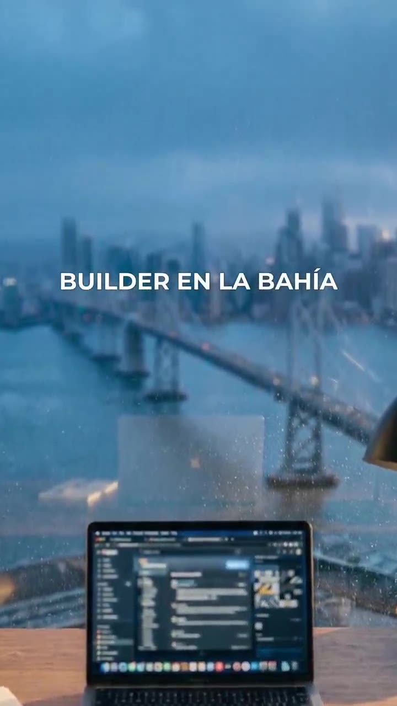
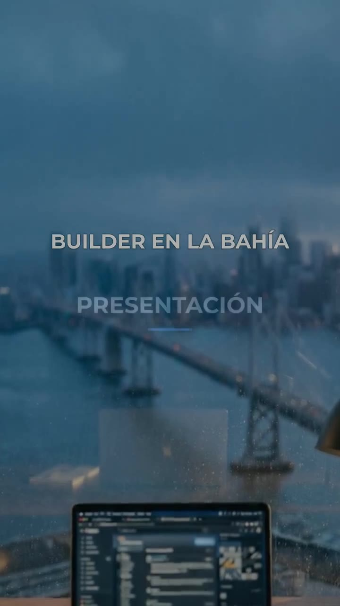
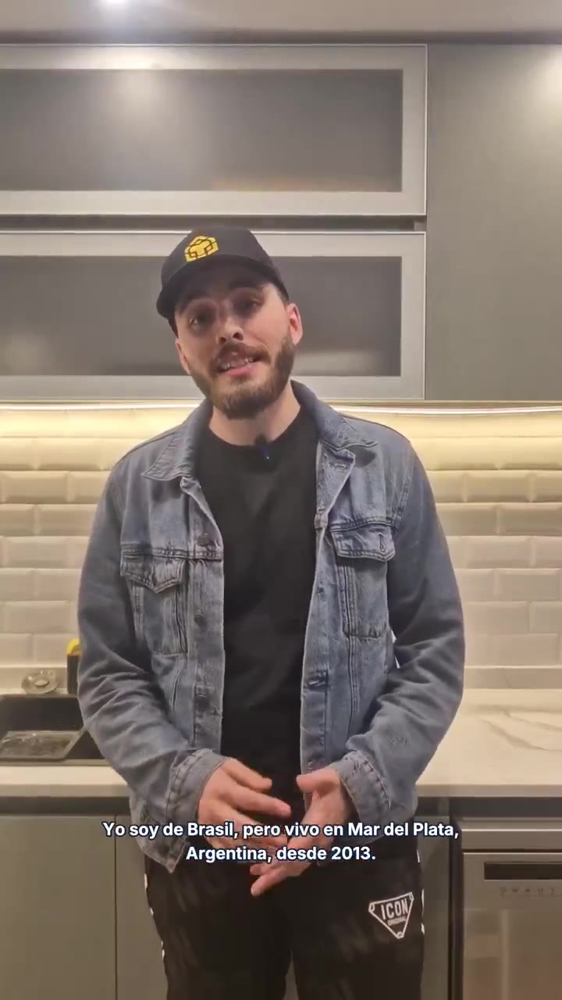
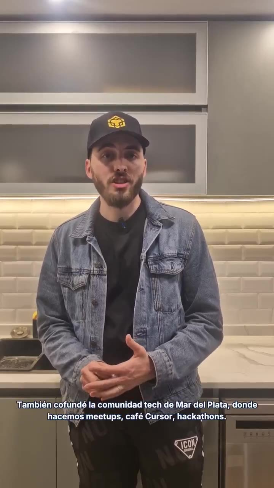
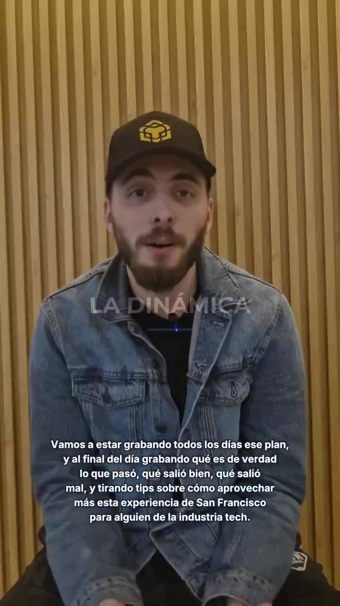
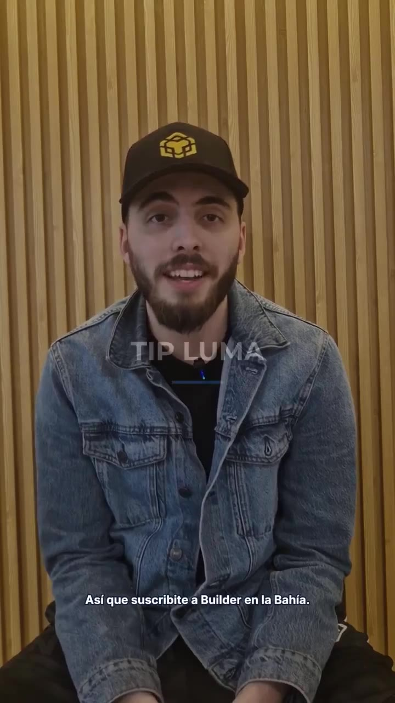
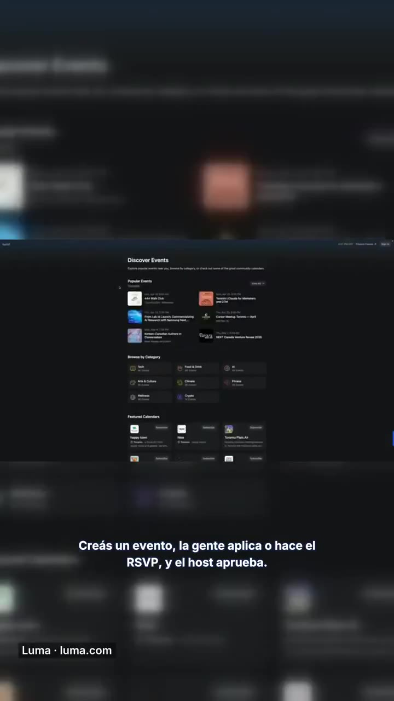
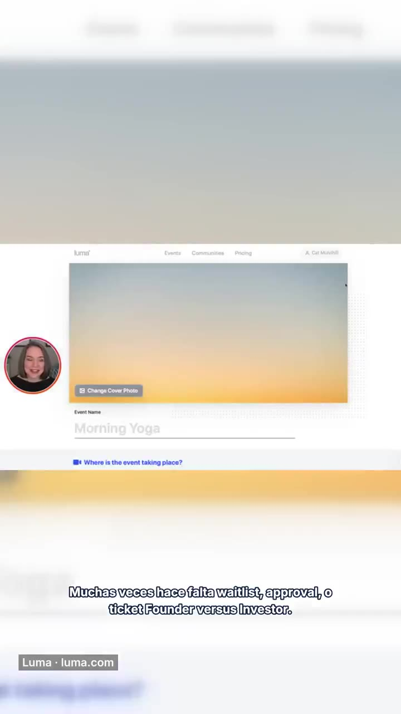
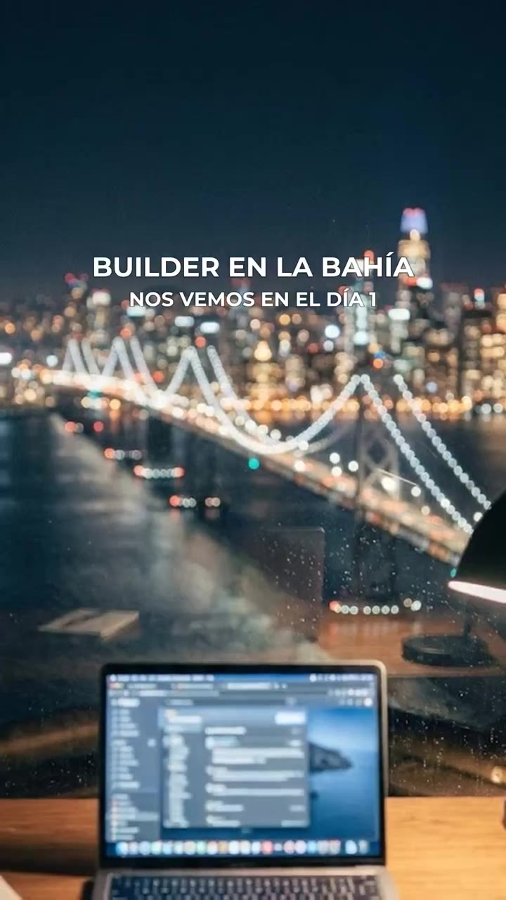

# Builder en la Bahía — Ep0 v4 audit

**Bar:** digital-marketing-agency promo vlog (vertical YouTube, paid craft).  
**Object:** `ep0_v4_builder_en_la_bahia_review720.mp4` (~2:48, 720×1280 proxy).  
**Reviewed:** 21 Sep 2026. Trip starts **27 Sep 2026**.  
**Companion:** [IMPROVEMENT-PLAN.md](./IMPROVEMENT-PLAN.md) · [proof/](./proof/) · [evidence/](./evidence/)

---

## Verdict (read this first)

**Do not publish this cut. Do not spend a Cloud Agent cycle “finishing” Ep0 from this footage.**

v4 is a **pipeline draft that passed house hygiene gates** (no `PRUEBA`, no take3, Inter instead of DejaVu, jump-cuts, Ken Burns beds). Those gates are not an audience bar. Against an agency promo vlog this is a **kitchen résumé with a stolen Luma tutorial taped in the middle**.

| Decision | Answer |
|---|---|
| Agency-promo quality? | **No. Overall 2.6 / 10.** |
| Ship as Ep0 / trailer on Luigi YouTube? | **No.** First 10s is silent AI keyart. Next 80s is one kitchen lock-off. Burned-in captions have **no word spaces**. Luma B-roll shows **another person’s webcam**. Audio **clips** (+1.3 dBTP). |
| Is a Cloud Agent re-edit of *this* A-roll worth it now? | **No as the episode. Yes as a 1-hour caption/loudness/crop salvage only after new pictures exist — or the 36s proof in `proof/` if you just need to see the edit ceiling.** |
| What actually blocks 27 Sep? | **Pictures Luigi has not shot:** hook to camera, product cutaways, own Luma phone, desk/walk B-roll. Edit cannot invent those. |

The producer pack (`CHECKLIST` 19/19 GREEN, `NARRATIVE_QA` PASS, “ready for Luigi Mac review”) measured **edit-script correctness**, not retention, brand, or legality of the Luma insert.

---

## Score vs agency promo vlog

Scores are 0–10 against a paid vertical promo (think: 3-second face hook, B-roll every 2–4s, readable type, music under VO, visual CTAs, product on screen when named). **5 = competent freelance. 7 = agency ship. 9 = paid talent + kit.**

| Pillar | Score | Why this number (evidence, not vibe) |
|---|---:|---|
| **Hook** | **2** | 10.5s Ken Burns on a still, no face, no promise, loud rock bed. The actual hook (“tres semanas / SF Tech Week”) lands at **~1:04**. That is a scroll-away on YouTube. |
| **Intro** | **3** | Identity eventually lands, but the open is a LinkedIn bio: UTN → four consultoras → four US startups → two founder brands → comunidad → BOTR → *then* the trip. An agency inverts that. |
| **Pacing** | **3** | ~80s of take2 is one locked kitchen frame. Jump-cuts remove dead air (~6.3s saved) but there are **no punch-ins**, so every cut is a pop in a static wide. Chapter cards are 1.35s of white type over a dissolve. Scene-change detect at 0.3 only fired once (Luma page flip at 147.9s). |
| **Captions** | **2** | Sidecar SRT is fine. **Burn-in ASS dropped every space.** On-screen: `YosoydeBrasil,perovivoenMardelPlata`. At 2:19.9 two cues stack. No box, no speaker label, no safe-area respect vs. chapter type. |
| **Audio** | **4** | Dialogue is usable and consistent (**−16.1 / −16.2 / −16.3 LUFS** on the three A-roll blocks; DeepFilterNet did its job). Intro **−8.9 LUFS**, outro **−10.4**, whole-file **−14.5** with **true peak +1.3 dBFS**. ~7 LU music-vs-VO jump + clipping. Kitchen/wood rooms still sound like rooms. |
| **B-roll** | **1** | **Zero own B-roll.** No desk, hands, walking, SF, phone, product. The only “coverage” is a **letterboxed desktop YouTube** of Luma (`Luma · luma.com`) with a **third-party woman in a face-cam** on a “Morning Yoga / Luma Demo Event” create flow. |
| **CTAs** | **3** | Verbal “suscribite” exists (~2:03). No subscribe animation, no handle, no end-screen, no link plate. Outro “NOS VEMOS EN EL DÍA 1” is the real series CTA and it sits on more AI keyart. |
| **Brand system** | **3** | Repeatable formula (KB day / chapter / A-roll / KB night) is a start. It is **not a kit**: Montserrat all-caps + #3B82F6 hairline, no logo lockup, no lower-third, no motion language. MdPDev ocean tokens are unused (fine if this is a personal channel — then the personal kit is still missing). AI laptop UI is garbled. |
| **Overall** | **2.6** | **Fail.** Honest first-week house test. Not a promo. |

---

## Method

- Watched the review720 proxy end-to-end (168.7s, 720×1280, 30fps, h264 ~276 kb/s, AAC 96k).
- Cross-checked producer docs: `CHECKLIST`, `TIMELINE`, `NARRATIVE_QA`, spoken transcript, SRT, v3 edit notes.
- Extracted 50+ timestamped frames; cropped caption rows; ebur128 loudness on whole file + five windows; scene-change pass.
- Master is documented as 1080×1920 / ~92 MB. **Do not judge sharpness from this 7.7 MB proxy.** Composition, type, coverage, and loudness *are* the same timeline.

---

## Section-by-section

Times are **master / review720**. Slot names from `ep0_v4_TIMELINE.md`.

### 0:00–0:10.5 — INTRO (Ken Burns day + father jingle)

**What is on screen.** Still of a MacBook on a wood desk, lamp head right, Bay Bridge / SF skyline through glass, dusk grade. Slow zoom. ~3.5s: `BUILDER EN LA BAHÍA` fades in, all-caps, centered. No VO. Jingle at **−8.9 LUFS**, TP **+0.6 dBFS**.

**What works.** The still is pretty. Series title is readable. No VO under the open (intentional, and correct for a sting).

**What fails.**

- This is **not a hook**. It is a title card that thinks it is a cold open. On vertical YouTube the face or the promise must be in the first second.
- The laptop UI is **AI-garbled**. Anyone who builds software will clock it in one glance.
- Ken Burns zooms toward the bay and **loses the desk** by ~0:09 — the only “builder” object exits frame.
- 10.5s is twice as long as the sting deserves. Agency: 1.5–3s max, or smash-cut from a 8-frame title.

**Agency would:** delete or crush to ≤3s, or replace with 1s title + face.

### 0:10.0–0:11.4 — CARD_PRESENTACIÓN

**What is on screen.** Not the promised `#0B0B0C` slate. White `BUILDER EN LA BAHÍA` + `PRESENTACIÓN` + a 2px #3B82F6 bar, **over the dissolving keyart**. Checklist line 7 (“bg #0B0B0C”) is **false in this encode**.

**What fails.** Looks like a Keynote build, not a chapter. 1.35s of no information. The accent bar is a hairline you will miss on a phone in daylight.

### 0:11.0–1:31.1 — AROLL_PRESENTACIÓN (take2, kitchen, ~81s)

**What is on screen.** Luigi standing mid-thigh-up in a grey-cabinet kitchen, white subway tile, denim jacket, black tee, black cap with yellow hex mark, **ICON sweatpants**, lav on the placket. Gold-style white captions with black edge. Hands clasped. Almost no blocking change for 80 seconds.

**Spoken (abridged).** Name → Brasil / MdP since 2013 → UTN / 10 years tech → Globant, GlobalLogic, Temperies, Concentrix → Cruisebound, SimpleNight, Disro, Ernesta → PsicoConecta, Pavla → MdP comunidad / café Cursor / hackathons → BOTR → *then* “este es mi intento… tres semanas… SF Tech Week.”

**What works.** He is clear, likable, and the story is true. Lighting on the torso is fine. Lav is a real mic. Jump-cuts removed ~4.6s of dead air.

**What fails.**

- **Framing:** ~30% of the frame is grey cabinet / ceiling. Face sits in the upper third with empty mass above. 9:16 wants chest-up, not knees-up.
- **Wardrobe:** cap bills a shadow into the eyes; ICON pants read as “I filmed between meetings,” not “promo.”
- **Coverage:** he names **twelve** orgs. **Zero logos, screens, or stills.** This is the single most expensive miss vs. agency (cutaways are free if you fetch assets).
- **Structure:** the trip — the only reason this video exists — is the last third of the block.
- **Captions:** spaces gone. Example at 0:13.5: `YosoydeBrasil,perovivoenMardelPlata,Argentina,desde2013.` See [evidence/10-captions-no-spaces.jpg](./evidence/10-captions-no-spaces.jpg).
- **Energy:** same lens height, same distance, same kitchen. Punch-ins were not used to hide the jump-cuts, so the cuts feel like errors.

**Agency would:** start on the SF sentence (or a new hook take), cover the CV with 1s logo chips, crop 130–150%, lose the hat, and cut this block to ≤25s.

### 1:31.7–1:33.1 — CARD_DINÁMICA

`LA DINÁMICA` + hairline, **over the kitchen** while the last caption (`yacompañameenBuilderenlaBahía`) is still up. Chapter and caption collide.

### 1:32.7–2:06.4 — AROLL_DINÁMICA (take1, wood wall, seated, ~34s)

**Correction vs. a casual watch:** this is **not** the same shot. Seated, wood-slat wall, tighter (chest-up). Better frame than the kitchen. Head-trim + jump-cut saved ~1.3s. Re-hello / “tres semanas” re-pitch correctly removed (narrative QA is right about *words*).

**Spoken.** Daily AM plan / PM what-really-happened + tips; mid-roll “publicidad de empresas mías y … código de referidos”; subscribe.

**What fails.**

- Still a single lock-off. No AM desk, no PM desk, no calendar, no walking — he *describes* a visual format without showing it.
- “Publicidad … código de referidos” is the worst possible phrasing for the sponsor slot he is trying to sell. Agency copy: “partners / herramientas que uso.” Then **show** a 5s mid-roll plate.
- Subscribe is voice-only. Caption: `AsíquesuscribiteaBuilderenlaBahía.`
- Four-line caption block covers the torso and is unreadable as a paragraph.

### 2:06.4–2:07.7 — CARD_LUMA

`TIP LUMA` over the wood take, subscribe caption still up. Same collision pattern.

### 2:07.3–2:19.9 — AROLL_LUMA_FACE_A (kitchen again)

Back to the **wide kitchen**. “Bueno, una de las herramientas…” — the “bueno” is a take-start that should have been trimmed. He defines Luma (calendar + tickets). No phone in hand. No app on screen.

At **2:19.9** two caption cues occupy the frame at once (SRT 22 ends 2:20.302, SRT 23 starts 2:19.902). See [evidence/11-caption-overlap-transition.jpg](./evidence/11-caption-overlap-transition.jpg).

### 2:19.9–2:32.5 — BROLL_LUMA_DEMOS (YouTube motion + take5 VO)

**This is the hard fail of the piece.**

- Horizontal **desktop** Luma (`Discover Events`) letterboxed into 9:16 with huge blurred bars. Body type is **illegible on a phone**.
- Lower-left label `Luma · luma.com` — this is a **YouTube/embed chrome**, not a designed lower-third.
- **2:27–2:32:** UI flips to a **create-event** flow (`Morning Yoga` → `Luma Demo Event`) with a **circular face-cam of a woman who is not Luigi**. He screen-recorded (or reused) a **third-party tutorial**. That is a rights problem and a trust problem.
- VO is useful (RSVP / waitlist / Founder vs Investor / “qué pasa esa noche”). The picture contradicts the VO: we are watching someone else teach Luma, not Luigi plan SF Tech Week.

**Agency would:** kill this insert on sight. Replace with a native 9:16 iPhone recording of *his* Luma, SF Tech Week events visible.

### 2:32.1–2:38.5 — AROLL_LUMA_FACE_C

Kitchen, hand on counter. “Anotarme a todos los eventos posibles de Luma.” Fine line. No visual of him actually tapping Register. Ends into outro xfade.

### 2:38.6–2:48.7 — OUTRO (Ken Burns night + cierre)

Night twin of the intro still. `BUILDER EN LA BAHÍA` / `NOS VEMOS EN EL DÍA 1`. Jingle **−10.4 LUFS**, TP **+1.2 dBFS**. Same garbled laptop UI.

**What works.** “Día 1” is the correct series promise.

**What fails.** Another 10.5s of still + music after the useful talk has ended. Night grade is nicer than day; it is still stock-AI identity.

---

## What fails (punch list)

Ship-blockers first.

| # | Defect | Type | Why it fails the agency bar |
|---|---|---|---|
| 1 | Burned-in captions have **no spaces** on every cue | Edit / pipeline | Unreadable. SRT is correct → ASS/fontsdir bug. Checklist marked this GREEN. |
| 2 | Caption **overlap** at 2:19.9 (two blocks) | Edit | Amateur. Also chapter titles collide with captions. |
| 3 | Luma insert is **someone else’s tutorial + webcam** | Legal / craft | Kill before any public upload. |
| 4 | Luma insert is **horizontal desktop**, unreadable in 9:16 | Coverage | Does not demonstrate the tip. |
| 5 | **No own B-roll** (desk / hands / walk / phone / SF) | Coverage | 2:48 of A-roll cannot be a vlog. |
| 6 | **No product cutaways** when naming Pavla, PsicoConecta, BOTR, Cursor, community, employers | Coverage | Résumé energy. Agency overlays logos in the same week they get the VO. |
| 7 | Hook buried at **1:04**; first 10.5s is silent AI | Structure | Retention suicide. |
| 8 | Kitchen **wide + ceiling + ICON pants + cap shadow** for the longest block | Camera | Cannot crop quality out of a 720 proxy; 1080 master can punch in, cannot fix wardrobe/light. |
| 9 | True peak **+1.3 dBFS**; intro **7 LU** hotter than VO | Audio | YouTube will limit. Sounds like two videos glued together. |
| 10 | CTAs are **voice only** | Design | Subscribe / Día 1 need plates. |
| 11 | Chapter cards are **xfade type**, not a system | Brand | Not `#0B0B0C` slates as documented. |
| 12 | AI keyart as series identity | Brand | Fine as a temp bed. Not a title sequence. |
| 13 | “código de referidos” said out loud | Copy | Kills sponsor sophistication. |
| 14 | 80s CV before the trip | Narrative | Wrong genre. This is a vlog trailer, not a conference intro. |

---

## Producer gates vs. what we actually saw

| Gate they marked GREEN | Reality in review720 |
|---|---|
| Chapter cards, bg `#0B0B0C` | Type over live picture during xfade. No slate. |
| Gold Spanish ASS / Inter | Font looks Inter-ish; **spaces stripped**. Not gold-standard. |
| Luma face → YT demos → face | True, and the YT demo is the worst shot in the file. |
| Narrative QA PASS | Word bans passed. **Story shape failed** (hook at 1:04). |
| Ready for Luigi Mac review | Ready as a **draft pack**. Not ready as a cut to approve for YouTube. |
| Review720 <10 MB | 7.7 MB. Soft. OK for review, not for judging grade. |

Hygiene that *did* land (credit the pipeline): no `PRUEBA`, no take3, no second hello in Dinámica, no “tres semanas” re-pitch, DeepFilterNet stems, 9:16 30fps, SRT sidecar exists.

---

## Is a Cloud Agent re-edit of Ep0 worth it **now**?

**Not a full episode re-edit. Footage is the bottleneck.**

| If you ask an agent to… | Worth it? |
|---|---|
| Rebuild the 2:48 as “the” Ep0 from kitchen + this Luma YT | **No.** You will get a prettier kitchen résumé. Same 70% drop in the first 3s if the AI open stays; same empty CV if cutaways are not shot/fetched. |
| Fix ASS spaces, limiter, shorten KB to 2s, punch-in crop, kill Luma YT, add logo chips | **Yes, ~hours, after assets exist.** This is plumbing, not a film. |
| Cut a 60–90s “coming 27 Sep” from *current* A-roll only (start at 1:04, keep Dinámica + Luma face, drop YT) | **Emergency Plan B only.** Still not agency. Better than publishing 2:48. |
| Assemble Ep0 **after** Luigi delivers the house shotlist (hook + Luma phone + desk/walk + product plates) | **Yes — that is the job.** Do it once, 22–25 Sep. |

The 33.5s file in [`proof/craft-demo-after-no-reshoot.mp4`](./proof/craft-demo-after-no-reshoot.mp4) is the ceiling of edit-only on take2: spaces restored, face crop, lower-third, company chips. **It is still a kitchen lock-off.** That is the point. Still: [`evidence/12-craft-demo-after.jpg`](./evidence/12-craft-demo-after.jpg).

---

## Evidence index

| File | Shows |
|---|---|
| `evidence/01-intro-kenburns-title.jpg` | AI keyart + all-caps title |
| `evidence/02-chapter-presentacion-xfade.jpg` | Chapter as dissolve type, not a slate |
| `evidence/03-kitchen-wide-lockoff.jpg` | Ceiling, pants, captions |
| `evidence/04-cv-no-cutaways.jpg` | Comunidad / Cursor named, nothing on screen |
| `evidence/05-dinamica-wood-seated.jpg` | Better set, paragraph captions |
| `evidence/06-chapter-tip-luma-overlay.jpg` | TIP LUMA vs. subscribe caption |
| `evidence/07-luma-letterbox-desktop.jpg` | Unreadable desktop Luma |
| `evidence/08-luma-third-party-facecam.jpg` | Other woman’s webcam + Morning Yoga |
| `evidence/09-outro-night-keyart.jpg` | Día 1 on night AI still |
| `evidence/10-captions-no-spaces.jpg` | Burn-in space bug |
| `evidence/11-caption-overlap-transition.jpg` | Two cues at once |
| `evidence/12-craft-demo-after.jpg` | Edit-only ceiling (crop + lower-third + spaced captions) |
