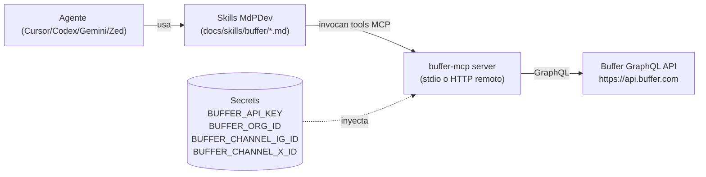

# Plan — Integración Buffer MCP para orquestar campañas IG / X

> Estado: propuesta inicial, pendiente de aprobación.
> Owner sugerido: equipo de growth + mantainers del repo.
> Alcance: integrar Buffer como canal de publicación automatizado controlado por agentes (Cursor, Codex, Gemini, Zed, Opencode) vía MCP, con skills reutilizables para armar campañas multi-canal.

---

## 1. Objetivo

Permitir que los agentes que corren sobre este repositorio puedan:

1. **Planificar** campañas de contenido para Instagram y X (Twitter) a partir de briefings cortos (evento, tema, tono MdPDev).
2. **Generar** variantes de copy/hashtags alineadas al tono y paleta de `BRAND.md`.
3. **Agendar** automáticamente los posts en Buffer (queue o `customScheduled`) sin intervención manual en la UI de Buffer.
4. **Auditar** y **rebalancear** la cola (mover, eliminar, repostear) desde el mismo flujo.
5. **Reportar** métricas básicas (posts enviados, engagement consolidado) como feedback para la próxima iteración de la campaña.

No objetivos (fuera de alcance en esta primera fase):
- Publicar directo a las APIs nativas de IG/X sin pasar por Buffer.
- Generar imágenes/video. La creatividad visual queda a cargo de otro skill / herramienta externa.
- Editar la landing `mardelplata-dev` en función del calendario (eso queda como evolución posterior).

---

## 2. Baseline de la API de Buffer

Fuente: https://developers.buffer.com

| Tema | Resumen |
|---|---|
| Endpoint | `POST https://api.buffer.com` (GraphQL) |
| Auth (dev / interno) | **API key** personal: `Authorization: Bearer <BUFFER_API_KEY>`. Se obtiene en *Settings → API* del dashboard. Alcance = toda la cuenta, sin scoping por org. Rate limit: 60 req/min por usuario autenticado. |
| Auth (multi-tenant) | **OAuth 2.0** Authorization Code + PKCE. Endpoint `https://auth.buffer.com/auth` + `https://auth.buffer.com/token`. Scopes necesarios: `posts:write posts:read account:read offline_access`. |
| Mutaciones clave | `createPost`, `updatePost`, `deletePost` |
| Modos de agendado | `addToQueue` (próximo slot libre del schedule del canal) y `customScheduled` (`dueAt` en ISO 8601 UTC) |
| Entidades | `Organization` → `Channel` (service: `twitter`, `instagram`, …) → `Post` |

**Implicancias para el plan**:

- Para MdPDev como organización única alcanza con una API key guardada en Vercel / secrets de Cursor. No hace falta implementar OAuth en esta fase.
- El rate limit (60 rpm) es generoso para un calendario de campaña; no requiere throttling sofisticado.
- Los canales de IG y X ya deben estar conectados en Buffer manualmente — la API no conecta cuentas nuevas.

---

## 3. Arquitectura propuesta



Tres piezas:

1. **Server MCP** que expone tools de Buffer (ver §4).
2. **Skills markdown** versionadas en este repo que los agentes leen para saber *cómo* armar una campaña (ver §6).
3. **Config de MCP** replicada en los cuatro clientes ya presentes (§7).

---

## 4. Opciones para el server MCP

Tres caminos, en orden de menor a mayor costo de mantenimiento:

### 4.1 Opción A — Remoto hospedado por terceros (más rápido)

- **Zapier MCP** (`https://zapier.com/mcp/buffer`): expone acciones de Buffer como tools MCP.
  - Pros: setup de minutos, sin deploy propio.
  - Contras: cubre subset limitado (crear idea, pausar cola, add-to-queue). No expone todas las mutaciones ni scheduling con `dueAt` arbitrario. Agrega un vendor intermedio con facturación por run.
- **ChatBotKit**: similar, lock-in a su plataforma.

Recomendación: descartar para producción; útil solo para un PoC de 1 día.

### 4.2 Opción B — Adoptar un server open source existente (recomendado para PoC → beta)

- `ahernan2/buffer-mcp` (TypeScript, usa la API GraphQL nueva). Tools: `getAccount`, `listOrganizations`, `listChannels`, `createPost`, `getPosts`, `customGraphQL`, `customFetch`.
- `tn819/buffer-mcp` (JS, API v1 legacy — **no adoptar**, la v1 está deprecada).

Propuesta: forkear `ahernan2/buffer-mcp` a la org de MdPDev, fijar commit, auditar (es un repo con poca adopción). Deployarlo como:

- **Stdio local** durante desarrollo (`npx buffer-mcp`).
- **HTTP remoto** (Vercel / Fly / Railway) para que todos los clientes MCP del equipo lo compartan. Este es el mismo patrón que ya usa `mcp.vercel.com` en nuestra config actual.

### 4.3 Opción C — Server propio mínimo en este repo (largo plazo)

Crear `apps/buffer-mcp/` dentro del monorepo, implementado con el SDK oficial de MCP (`@modelcontextprotocol/sdk`) y un cliente GraphQL liviano (`graphql-request`). Ventajas:

- Tools modeladas 1:1 con los skills de MdPDev (ej. `schedule_campaign_post` acepta `{channel: "ig"|"x", ...}` y resuelve `channelId` internamente desde los secrets — el agente nunca maneja IDs crudos).
- Podemos agregar *policies* (validar largo de tweet ≤ 280, rechazar emojis fuera del tono, forzar hashtags de la comunidad).
- Se mantiene junto al resto del repo, misma CI.

**Recomendación final**: arrancar por **Opción B** para validar UX con agentes en 1-2 iteraciones; si se valida, migrar a **Opción C** con la superficie de tools adaptada a los skills.

---

## 5. Superficie mínima de tools MCP

Contrato que el server MCP tiene que exponer (sea fork o propio). Nombres pensados para que el agente los elija inequívocamente.

| Tool | Input | Output | Notas |
|---|---|---|---|
| `buffer_list_channels` | `{ organizationId? }` | `[{ id, name, service }]` | Usado por agentes para resolver nombres amigables ("instagram", "x") a IDs. Se cachea en memoria por sesión. |
| `buffer_get_queue` | `{ channelId, limit?, status?: "scheduled"\|"sent" }` | `[{ id, text, dueAt, media? }]` | Vista del pipeline actual antes de agregar más. |
| `buffer_schedule_post` | `{ channel: "instagram"\|"x", text, dueAt?, media?: [url], firstComment?, threadParts?: string[] }` | `{ postId, dueAt }` | Wrapper de `createPost`. Si `dueAt` vacío → `addToQueue`. Para X soporta hilo (multiple tweets); para IG ignora `threadParts`. |
| `buffer_update_post` | `{ postId, text?, dueAt? }` | `{ postId, dueAt }` | Wrapper de `updatePost`. |
| `buffer_delete_post` | `{ postId }` | `{ ok: true }` | Wrapper de `deletePost`. |
| `buffer_bulk_schedule` | `{ items: SchedulePostInput[] }` | `{ created: [...], errors: [...] }` | Atajo para agendar una campaña completa en una sola llamada; el server hace los N mutates con backoff ante 429. |
| `buffer_dry_run` | `SchedulePostInput` | `{ ok, warnings[], rendered: {...} }` | **No llama a Buffer**. Valida largo, hashtags, emojis, imágenes accesibles. Se corre antes de `schedule_post` en los skills para abortar si hay errores. |

Policies que el server debe hacer cumplir (lado código, no sólo prompt):

- X: `text.length ≤ 280` por tweet; hilo máx 25 partes.
- IG: `media.length ≥ 1` (IG no permite post solo texto vía Buffer API salvo "ideas").
- `dueAt` solo UTC; si el input viene con TZ `America/Argentina/Buenos_Aires` el server lo normaliza.
- Ventana mínima: `dueAt > now + 15min` para evitar drift.

---

## 6. Skills para los agentes

Ubicación propuesta: `docs/skills/buffer/` (markdown, versionado en git, consumido por los agentes como contexto). Cada skill es un archivo corto con: objetivo, inputs esperados, pasos exactos con tool calls MCP, criterios de éxito.

Catálogo inicial:

| Skill | Archivo | Responsabilidad |
|---|---|---|
| **Planner de campaña** | `plan-campaign.md` | Dado un brief (`{evento, fechas, canales}`) produce un *calendar plan* JSON: N posts × canal × fecha, sin llamar a Buffer. Es determinístico y revisable. |
| **Generador de copy MdPDev** | `generate-copy.md` | Convierte el calendar plan en copies finales respetando `BRAND.md` (tuteo, local, CTA WhatsApp). Una variante por post. |
| **Adaptador IG** | `adapt-instagram.md` | Toma un copy genérico y lo reformatea a IG: caption ≤ 2200, primeros 125 chars con hook, hashtags al final o como *first comment*, pide imagen obligatoria. |
| **Adaptador X** | `adapt-x.md` | Reformatea a X: single tweet ≤ 280 o hilo hasta 5 partes. Decide thread vs single basado en densidad de info. |
| **Agendador Buffer** | `schedule-on-buffer.md` | Corre `buffer_dry_run` por cada item, y si todos pasan, `buffer_bulk_schedule`. Si alguno falla, aborta y reporta. |
| **Auditor de cola** | `audit-queue.md` | Lista la cola por canal, detecta: solapes < 2h, hashtags duplicados en 7 días, posts sin media en IG. Retorna acciones sugeridas. |
| **Rebalanceador** | `rebalance-queue.md` | Aplica las sugerencias del auditor usando `buffer_update_post` / `buffer_delete_post`. Solo se ejecuta con aprobación explícita en el prompt. |
| **Post-mortem de campaña** | `campaign-postmortem.md` | Después de la fecha de evento, lista `status: sent`, anota en un doc `docs/campaigns/<slug>.md` qué salió y cuándo, deja TODO para sumar engagement manual. |

Patrón común en cada skill:

```
Inputs: (estructura mínima)
Preconditions: (secrets / channels existentes)
Steps:
  1. (qué tool MCP llamar, con qué args)
  2. (validación antes del siguiente paso)
Outputs: (contrato de retorno)
Failure modes: (cómo abortar sin dejar estado inconsistente)
```

Skill "meta" sugerida: `docs/skills/buffer/README.md` con el árbol de decisión — "si el usuario dice *agendar la campaña de evento X*, arrancá por `plan-campaign.md`; si dice *revisar la cola*, arrancá por `audit-queue.md`".

---

## 7. Cambios de configuración MCP

Hay que registrar el server `buffer` en los cuatro archivos de clientes MCP que ya existen, manteniendo el estilo actual. Asumiendo que lo deployamos como HTTP remoto en, por ejemplo, `https://buffer-mcp.mdpdev.ar`:

### `config/mcporter.json`

```json
{
  "mcpServers": {
    "vercel": { "type": "http", "url": "https://mcp.vercel.com" },
    "buffer": {
      "type": "http",
      "url": "https://buffer-mcp.mdpdev.ar",
      "headers": { "Authorization": "Bearer ${BUFFER_MCP_TOKEN}" }
    }
  }
}
```

### `.codex/config.toml`

```toml
[mcp_servers.vercel]
type = "http"
url = "https://mcp.vercel.com"

[mcp_servers.buffer]
type = "http"
url = "https://buffer-mcp.mdpdev.ar"
headers = { Authorization = "Bearer ${BUFFER_MCP_TOKEN}" }
```

### `.gemini/settings.json`

```json
{
  "mcpServers": {
    "vercel": { "type": "http", "url": "https://mcp.vercel.com" },
    "buffer": {
      "type": "http",
      "url": "https://buffer-mcp.mdpdev.ar",
      "headers": { "Authorization": "Bearer ${BUFFER_MCP_TOKEN}" }
    }
  }
}
```

### `.zed/settings.json`

```json
{
  "context_servers": {
    "vercel": { "source": "custom", "type": "http", "url": "https://mcp.vercel.com", "headers": {} },
    "buffer": {
      "source": "custom",
      "type": "http",
      "url": "https://buffer-mcp.mdpdev.ar",
      "headers": { "Authorization": "Bearer ${BUFFER_MCP_TOKEN}" }
    }
  }
}
```

### `opencode.json`

```json
{
  "mcp": {
    "vercel": { "type": "remote", "url": "https://mcp.vercel.com", "enabled": true },
    "buffer": {
      "type": "remote",
      "url": "https://buffer-mcp.mdpdev.ar",
      "enabled": true,
      "headers": { "Authorization": "Bearer ${BUFFER_MCP_TOKEN}" }
    }
  }
}
```

Alternativa local-only (cuando alguien del equipo está desarrollando el server) — reemplazar el bloque `buffer` por un `stdio`:

```json
"buffer": { "type": "stdio", "command": "npx", "args": ["-y", "buffer-mcp"] }
```

---

## 8. Secrets y variables de entorno

A guardar en **Vercel** (para el server MCP deployado) y en **Cursor Dashboard → Cloud Agents → Secrets** (para que los agents locales/cloud lo vean):

| Nombre | Dónde | Para qué |
|---|---|---|
| `BUFFER_API_KEY` | Server MCP | Auth contra `api.buffer.com`. |
| `BUFFER_ORG_ID` | Server MCP | Evita consultar `account.organizations` en cada request. |
| `BUFFER_CHANNEL_IG_ID` | Server MCP | Mapea el alias `"instagram"` de los skills. |
| `BUFFER_CHANNEL_X_ID` | Server MCP | Mapea el alias `"x"` de los skills. |
| `BUFFER_MCP_TOKEN` | Clientes MCP (los JSON/TOML de §7) | Token compartido que el server exige para que solo nuestros agentes lo usen. |
| `BUFFER_TIMEZONE` | Server MCP (default `America/Argentina/Buenos_Aires`) | Normalizar `dueAt`. |

Notas:

- El `BUFFER_MCP_TOKEN` es **distinto** de la `BUFFER_API_KEY`. El server MCP hace el *mapping* adentro; los clientes nunca ven la API key de Buffer.
- Ningún secreto se commitea. Añadir una sección en `.env.example` si se crea.

---

## 9. Flujo end-to-end de una campaña (happy path)

Caso típico: "Campaña Cursor Café edición Noviembre 2026, 3 posts IG + 4 tweets + 1 hilo, del 1 al 15/11".

1. PM abre Cursor y escribe: *"Armá campaña Cursor Café noviembre, evento el 15/11 19hs, mismo tono que la última"*.
2. Agente carga `docs/skills/buffer/README.md` y resuelve que arranca por `plan-campaign.md`.
3. `plan-campaign` produce un JSON de 8 items con fechas tentativas y canal. Se lo muestra al usuario para aprobar.
4. Si OK, `generate-copy` crea copies v1. `adapt-instagram` / `adapt-x` ajustan por canal.
5. `schedule-on-buffer` corre `buffer_dry_run` por cada uno. Si hay warnings (ej. caption IG sin media), pide assets al usuario o los marca como draft.
6. Cuando todos pasan, invoca `buffer_bulk_schedule`. Reporta IDs devueltos.
7. El agente commitea `docs/campaigns/cursor-cafe-nov-2026.md` con el calendar final y los `postId` retornados (trazabilidad).
8. Post-evento, `campaign-postmortem` actualiza el mismo doc.

---

## 10. Rollout por fases

| Fase | Alcance | Criterio de cierre |
|---|---|---|
| **0 — Preparación** | Conectar cuentas IG y X a Buffer manualmente. Generar API key. Cargar secrets. Crear branch `feat/buffer-mcp`. | API key válida devuelve `account.organizations` con curl. |
| **1 — PoC con fork** | Forkear `ahernan2/buffer-mcp`, auditar, deployar en Fly/Railway con `BUFFER_MCP_TOKEN`. Registrar en los 4 clientes MCP. | Un agente puede listar channels y agendar 1 tweet de prueba a un tiempo futuro. |
| **2 — Skills v1** | Escribir `plan-campaign`, `generate-copy`, `adapt-x`, `adapt-instagram`, `schedule-on-buffer`, `audit-queue`. Probar con 1 campaña real. | Una campaña real corre end-to-end con <10% intervención manual. |
| **3 — Hardening** | Migrar a server propio (Opción C) si el fork queda corto: agregar `buffer_dry_run`, policies, `buffer_bulk_schedule` atómico. CI que lintea los skills (ej. valida YAML frontmatter). | Dry-run bloquea los errores conocidos que se vieron en fase 2. |
| **4 — Evolución** | `rebalance-queue`, `campaign-postmortem`, integración con el calendar de `Events.tsx` para que la fecha del evento en la landing dispare propuestas de campaña. | Propuesta de campaña auto-generada al crear un evento en el site. |

---

## 11. Riesgos y mitigaciones

| Riesgo | Impacto | Mitigación |
|---|---|---|
| Buffer cambia la GraphQL (está en beta) | Rompe todas las skills | Mantener el cliente GraphQL aislado en el server MCP; contract tests semanales contra `api.buffer.com` en CI. |
| Instagram Graph cambia y Buffer no publica | Posts queued no salen | El skill `audit-queue` corre 10 min antes del `dueAt` y verifica estado; alerta en Slack si hay `failed`. |
| Rate limit 60 rpm durante una campaña grande | 429 en medio del bulk | `buffer_bulk_schedule` implementa retry exponencial (4s, 8s, 16s). |
| API key filtrada | Acceso a toda la cuenta Buffer | Key vive solo en el server MCP; rotación programada trimestral; los clientes MCP usan `BUFFER_MCP_TOKEN` separado que se puede rotar sin tocar Buffer. |
| Server MCP fork sin mantenimiento | Vulnerabilidades | Pin a commit, SBOM, migrar a Opción C si el repo queda stale > 90 días. |
| Copy off-brand publicado automáticamente | Daño de marca | `buffer_dry_run` + revisión humana obligatoria en fase 1-2; *auto-publish* solo se habilita post-fase 3 y con dry-run en verde. |

---

## 12. Decisiones abiertas

Cosas que hay que confirmar antes de empezar la Fase 1:

1. ¿Usamos **el plan Free de Buffer** (3 canales, 1 usuario) o pagamos plan Essentials? Afecta si podemos tener IG + X + (futuro) LinkedIn de la comunidad.
2. ¿El server MCP lo deployamos en **Vercel** (ya tenemos proyecto) o en Fly/Railway (long-running, mejor para MCP HTTP con SSE)?
3. ¿Los **skills viven en `docs/skills/`** (fácil de leer para humanos) o bajo `.cursor/rules/` (más propio del stack de Cursor)? Propuesta por defecto: `docs/skills/` + un `.cursor/rules/buffer.mdc` liviano que apunte a esa carpeta.
4. ¿Los `postId` y los calendars de campaña se commitean a git o viven en una tabla Supabase (ya tenemos Supabase configurado)? Commit tiene mejor trazabilidad; Supabase permite dashboards.
5. ¿Qué humano aprueba cada campaña antes del `schedule-on-buffer`? ¿Un único owner o cualquier mantainer del repo?

---

## 13. Próximos pasos inmediatos

1. Aprobar o ajustar este plan (puntos §12).
2. Generar API key en Buffer y cargarla en Cursor Secrets (read-only para este repo).
3. Abrir issue/epic por fase (§10) con owner.
4. Arrancar Fase 0 — sin código todavía, solo secrets + conexión de cuentas.

