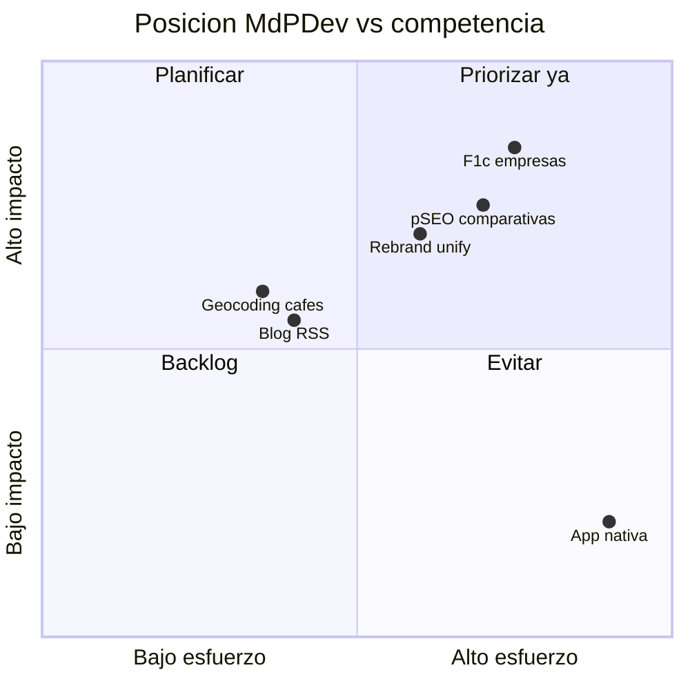

# Gap analysis — MdPDev vs referentes (jun 2026)

## Objetivo

Identificar brechas funcionales, de marca, SEO y operativas entre el estado actual de `mardelplata.dev.ar` y los referentes del panorama competitivo.

## Método

- Inventario de código y rutas (76 páginas en build)
- Comparación contra matriz en [`2026-06-competitive-landscape.md`](2026-06-competitive-landscape.md)
- Cruce con auditoría previa [`docs/nomad-it-hub/06-audit-qa-plan.md`](../nomad-it-hub/06-audit-qa-plan.md)

## Estado actual por área

| Área | Estado | Gap vs referentes |
|------|--------|-------------------|
| Landing + IA 3 audiencias | Completo | Fricción visual dual (ocean vs editorial shell) |
| Auth + perfiles + QR | Completo | — |
| Eventos + scanner | Completo | Falta export `.ics` (ENG-02) |
| Bolsa de trabajo | Completo | Sin integración LinkedIn auto (MAR-13) |
| Primer Trabajo OS | Completo | Solo localStorage; sin sync cloud |
| Nomad Hub (contenido) | Completo | Subrutas costo/internet/barrios pendientes |
| Empresas F1 | Parcial (~14 JSON) | Dealroom/Ruta N tienen 200+ empresas |
| Cafés F3 | Parcial (11/22 geo) | Freework tiene reviews maduras + app |
| Red OSS | Parcial | BAGD/Prog. AR tienen comunidad activa |
| Blog | Parcial | Agregador RSS dormido |
| Newsletter | Parcial | Sin double-opt-in / Resend |
| i18n EN | Parcial (2 rutas) | Invest in Estonia es 100% bilingüe |
| Marketing automation | Parcial | MAR-8 Buffer pipeline in progress |

## Gaps funcionales (priorizados)

### P0 — Bloquean confianza o QA

| ID | Gap | Impacto | Referente que lo tiene |
|----|-----|---------|------------------------|
| G-P0-1 | DDL `cafes`/`cafe_votes` no versionado en repo | Reproducibilidad schema | Freework (datos completos) |
| G-P0-2 | QA dinámico sin credenciales Supabase en CI/agents | 60% features sin test | Estándar industria |
| G-P0-3 | Filtros `/red/ideas` (following/mine) UI-only | Red parece rota | BAGD (filtros reales) |

### P1 — Valor usuario / SEO

| ID | Gap | Impacto | Referente |
|----|-----|---------|-----------|
| G-P1-1 | Empresas en JSON estático, sin self-service | Escala B2B limitada | Dealroom, Ruta N |
| G-P1-2 | 11 cafés sin geocoding | Mapa incompleto | Freework |
| G-P1-3 | Blog con 2 items hardcoded | Contenido stale | Nomad List (fresh data) |
| G-P1-4 | Newsletter sin confirmación email | Riesgo spam / baja calidad lista | Ruta N newsletter |
| G-P1-5 | Calculadora costo de vida ausente | Intención búsqueda alta | Nomada.tools |
| G-P1-6 | Comparativas pSEO (MdP vs BA) ausentes | Tráfico decisión | Nomad List |

### P2 — Growth / polish

| ID | Gap | Impacto |
|----|-----|---------|
| G-P2-1 | i18n EN solo 2 rutas | Audiencia internacional limitada |
| G-P2-2 | GA4 / GSC no conectados (MAR-11) | Sin datos para priorizar |
| G-P2-3 | Red sin seed content comunitario | Empty state permanente |
| G-P2-4 | Playwright E2E ausente | Regresiones manuales |
| G-P2-5 | `<html lang>` global `es` en rutas EN | a11y/SEO menor |

## Gaps de marca

| ID | Gap | Rutas afectadas | Severidad |
|----|-----|-----------------|-----------|
| G-B-1 | Dos capas visuales sin reglas operativas claras en código | Home vs AppShell vs auth vs brand | Media |
| G-B-2 | Wordmark "MdPDev" vs "mardelplata.dev" en navbar | Home (shell) vs metadata (MdPDev) | Baja |
| G-B-3 | Brand Book v2 incompleto en `/brand` | MAR-7 in progress | Media |
| G-B-4 | OG default `/mdpdev.png` en layout global | Compartir en redes | Resuelto parcial (OG dinámico por ruta hub) |
| G-B-5 | Handles redes: @mardelplata.dev.ar vs @Mardeldev | Consistencia externa | Baja |

Ver auditoría detallada: [`2026-06-brand-audit-capas.md`](2026-06-brand-audit-capas.md)

## Gaps SEO

| ID | Gap | Estado |
|----|-----|--------|
| G-S-1 | Google Search Console no conectado | Pendiente equipo |
| G-S-2 | FAQPage JSON-LD en todas las guías | Parcial (estudiar/que-hacer ok) |
| G-S-3 | hreflang solo 2 pares ES/EN | Parcial |
| G-S-4 | Comparativas pSEO sin dato propio | No iniciado |
| G-S-5 | Home ISR 5m | Resuelto (audit P1) |

## Gaps operativos / infra

| ID | Gap | Acción |
|----|-----|--------|
| G-O-1 | Secrets Supabase en Cloud Agents | Configurar en dashboard |
| G-O-2 | Linear mardelplatadev no conectado a MCP | Conectar workspace o import manual |
| G-O-3 | MAR-5..14 sin reconciliar con backlog nuevo | Ver [`docs/linear/MAR-ROADMAP-RECONCILIATION.md`](../linear/MAR-ROADMAP-RECONCILIATION.md) |

## Mapa de brechas vs ventajas

## Recomendación (orden de cierre)

1. **Infra:** Secrets Supabase + `019_cafes.sql` + GSC
2. **Datos:** F1c empresas Supabase + ampliar seed ATICMA
3. **Comunidad:** Red filtros + seed content + blog RSS
4. **Growth:** Calculadora costo + MAR-8/11 marketing pipeline
5. **Marca:** Decisión rebranding (ver rebrand-options) antes de push Q3

## Nivel de confianza: **Alta**

Basado en inventario de código verificado con `npm run build` (76 rutas, jun 2026).
